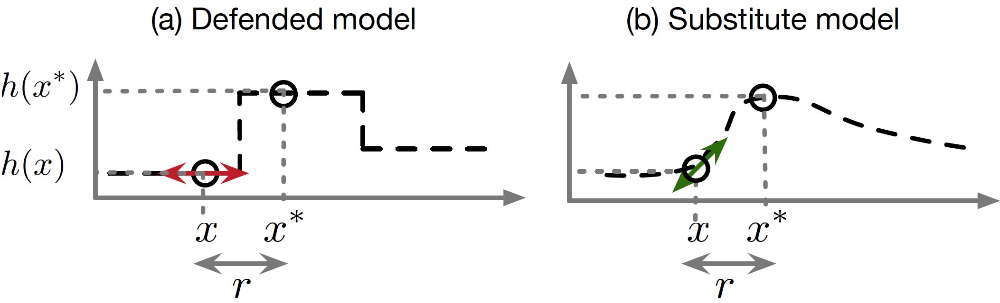

# Is attacking machine learning easier than defending it?

Feb 15, 2017
by Ian Goodfellow and Nicolas Papernot

在我们的第一篇博文中，我们展现了一些攻击者可以用来破坏现有的机器学习系统的方法，比如用学习算法 [BNL12] 在训练集中投毒，或者制造对抗样本来使模型做出错误的预测 [SZS13]。在这篇博文中，我们会拿对抗样本做例子，来说明为什么攻击机器学习看起来要比防御更简单。换句话说，我们会细致地介绍一些为什么我们仍然不能完全有效地防御对抗样本的原因，以及我们是否真的能奢求这样地防御。

一个对抗样本是针对某个个机器模型的输入，它经过了攻击者精心地设计，从而来糊弄这个模型使它产生错误的输出。举个例子，我们可以在一个熊猫的图片上加上一个精心计算过的小扰动来使得这个图片被以高置信度识别成长臂猿 [GSS14]:

如今，设计一些这样来愚弄模型的花招，要比设计出不被愚弄的模型简单多了。

## 我们如何试图让机器学习模型在对抗样本前面更鲁棒？

让我们来看看两种防御技巧：对抗训练和防御蒸馏，作为例子来看看一个防御方如何尝试使得机器学习模型更鲁棒以及减轻对抗样本能造成的危害。

**对抗训练** 尝试通过主动在训练的时候生成对抗样本去提高模型在测试阶段的泛化性。这个想法是 Szegedy 等人 [SZS13] 首先提出的。但是当时并不可行因为生成对抗样本的计算开销过高。Goodfellow 等人展示了如何通过快速梯度符号法来以低（计算）成本的方式生成对抗样本，并使训练过程中生成大批量的对抗样本变得计算高效 [GSS14]。然后把相同标签的对抗样本和原始样本分配给模型训练--举例来说，我们可能会拿一张猫的图片，对其进行对抗扰动来欺骗模型让它认为这是一个秃鹰，再告诉模型这还是应该被识别成一只猫。在 cleverhans 这个库中提供了对抗训练的一个开源实现，这个[教程](https://github.com/tensorflow/cleverhans/tree/master/examples)提供了它的用法。

**防御蒸馏** 使得对手利用的对抗方向中的模型的决策平面更平滑。蒸馏是一种通过一个模型来预测另一个更早的模型的概率化输出的训练过程中的步骤。蒸馏第一次是由 Hinton 等人提出 [HVD15]，当时目的是用一个小的模型来模拟一个大的，计算开销昂贵的模型。防御蒸馏有一个不同的目标：简单地使得最后的模型的反应更平滑从而能更好的奏效，即使模型间是一样的大小。训练一个模型来预测另一个有着相同架构的模型的输出也许看起来是有点有悖常理的。它奏效的原因是第一个模型是由“硬”标签训练的（100% 的概率一个图片是狗而不是猫）而第二个模型是用“软”标签（95% 的概率一个图片是个狗而不是猫）来训练的。第二个*蒸馏后*的模型在面对类似快速梯度信号 [PM16] 或以雅可比为基础的显著图 [PMW16] 更鲁棒。这两种攻击方法的实现同样可以在 [cleverhans](https://github.com/tensorflow/cleverhans) 中找到，参照[这里](https://github.com/tensorflow/cleverhans/blob/master/tests_tf/test_mnist_tutorial_tf.py)和[这里](https://github.com/tensorflow/cleverhans/blob/master/tests_tf/test_mnist_tutorial_jsma.py)。

## 一种失败的防御：gradient masking （梯度掩码）

大多数对抗样本构造技术通过模型的梯度来做攻击。简单地说，他们看着一张机场的照片的时候，他们测试这个图片空间中的哪个方向能使变成“猫”的概率增加，然后他们往那个方向稍微推动一下（换句话说，他们给输入一点扰动）。然后，这个修改后的图片被误认为是只猫。

但如果没有梯度的话呢？如果对图像的微调不能造成模型输出的改变呢？这看起来起到了一些防御的效果，因为攻击者不知道怎么去“推”这个图片了。

我们很容易就能想到一些简单的方法来去掉梯度。比如，大多数图片分类模型可以被分为这两种模式：输出最可能的类的标签和输出各个类别的概率。如果模型输出的是“99.9% 机场，1% 猫”，那么一点对于输入的小改变就能给输出带来小改变，于是梯度就会告诉我们那些改变可以带来在“猫”的概率上的增加。然而当我们使用的模型只是输出只有“飞机”这一个类别的话，那么输入的微调就一点也不会改变输出了，而梯度就不能给我们带来任何东西了。让我们来做一个思想实验，看看我们如何通过这个“最近类”而不是“概率模式”来让我们的模型防御对抗样本的。攻击者不再知道怎么找到能被分类成猫的输入，所以我们似乎取到了一些防御效果。然而不幸的是，之前那些被错分成猫的样本现在还是被分类成猫。如果攻击者能够猜到哪几个点是对抗样本的话，这些点仍然能导致错分类。我们并没有使得这个模型更鲁棒，我们只是给了攻击者更少的线索来弄清模型防御时的漏洞在哪。甚至更不幸的是，事实证明攻击者有一个非常好的策略来猜测防御的漏洞在哪。攻击者可以自己训练一个平滑的，有梯度的模型，然后生成对抗样本，再针对我们不平滑的模型部署这些对抗样本。很多时候，我们的模型也会把这些样本分错。最后，我们的思想实验表明隐藏掉梯度并没有什么用。

因此，我们把这个有缺陷的防御策略叫做 **gradient masking**，一个在 [PMG16] 中引用的术语。这种使用 **gradient masking** 的防御策略通常会使得模型在特定的方向和训练样本附近特别平滑，这让它对攻击者来说更难找到可取的梯度来对输入进行扰动，从而去危害模型。然而，攻击者可以训练一个替换的模型--一个能够通过防御模型对观察攻击者精心挑选的输入产生的标签，来模拟防御模型的副本。[PMG16] 中介绍了一个这种模型提取攻击的过程。攻击者可以用置换模型的梯度来找到对抗样本，而这些对抗样本同样会被防御（原有的）模型误分类。下面的图片重现了 [PMG16] 对梯度掩码探索的讨论，我们通过一维的机器学习问题来为这种攻击策略举例。在高维的问题中，这种梯度掩码的现象会更严重，不过更难描绘。

令人惊奇的是，我们发现对抗训练和防御蒸馏都巧合地起到了一种梯度掩码的作用。如果我们把我们从一个模型中训练到的对抗样本迁移到另一个用这些防御策略训练的模型，这个攻击也经常成功，甚至在对第二个模型直接攻击失败的时候 [PMG16]。这说明了两种训练技巧都是在使模型更平滑并去除梯度而不是确保它把点分类得更对。

## 玩玩「打地鼠」这个游戏

在「梯度隐藏」这个游戏中，我们发现 **gradient masking** 并不是一种很好的防御策略。它能抵抗使用梯度的攻击者，但是如果攻击者知道我们用了这种防御策略，他们可以选择换一种攻击模式。在安全领域的术语里，这意味着 **gradient masking** 不是一种 **自适应** 的防御

许多被提出来应对攻击样本的防御表现得都不是很好，而即便有个起效的也不具有适应性。这意味着这就像他们在玩一个打地鼠游戏一样：他们只是关闭了一些漏洞，但是其他的仍然开着。

对抗训练要求选择一种算法来生成对抗样本。通常，训练模型时需要能抵抗通过单步生成的简易的对抗样本，比如 **fast gradient sign** 方法。在训练得能抵抗这些简易的对抗样本置换，这个模型通常能够抵抗一些同种类的简易对抗样本的新的样本。如果我们使用一些精致的，迭代过的对抗样本，比如那些在 [SZS13] 中的，模型通常就会被欺骗。

要保证适应性是很有挑战性的。或许可以从[差分隐私](https://www.cis.upenn.edu/~aaroth/Papers/privacybook.pdf)的框架中获取灵感，它提供了一种正式的保证能使得一种随机的算法不会暴露个体用户的隐私。这种保证对攻击者的知识或能力不做任何假设，因此它能够应对未来的攻击者的可能的假想的攻击。

## 为什么防御对抗样本这么难

对抗样本之所以这么难以防御，是因为很难为对抗样本的制作过程来构造一个理论模型。对抗样本是许多机器学习模型（包括神经网络）中的非线性和非凸的优化问题的一组解。因为我们没有好的理论工具来描述这些复杂优化问题的解，所以也很在哪种防御手段能有效的解决对抗样本上做任何理论论证。

从另一个角度来说，对抗样本之所以难以防御是因为这要求机器模型在任何可能的输入下都产生准确的输出。然而大部分时候，机器学习模型只在少量的它们考虑到的可能的输入下表现得好。

由于存在巨量的各种可能的输入，设计一个真正能够 **自适应** 的防御就成了一件非常难的事。

## 其他的攻防情景

许多其他的针对机器学习的攻击也是难以防御的。在过去中，我们主要聚焦在测试时的输入从而来糊弄一个机器学习模型，但是也有许多其他可能的攻击，比如偷偷修改训练集，让模型按照攻击者训练成他想要的方式。

一个对抗机器学习中的新星是差分隐私，在这个领域上我们真的有理论上的论断可以说，训练算法可以避免攻击者从一个训练好的模型的训练集中恢复出敏感信息。

把机器学习和其他情景下共有的一些攻防手段是一件有趣的事。

在密码学中，防御这看起来更占优势一些。给定一些合理的假设，比如加密算法已经被正确地实现，防御者可以可靠的发送一个消息而攻击者不能解密。

在物理的碰撞中，攻击者似乎更有优势。建造核弹要比建造能抵御核弹的城市简单多了。热力学第二定律表明，如果防御者需要把熵维持在某个阀值以下，那么即使没有攻击者来故意把熵增加，随着时间带来的熵增，防御者也会失败。

监督学习中的「没有免费的午餐」定理 [W96] 表明，当平均到所有可能的数据集上的时候，没有一种机器学习算法在测试的时候能在一个新的数据上表现的比其他算法更好。乍一看，似乎表示所有的算法都很容易受对抗样本的干扰。然而，「没有免费的午餐」定理只在我们不对问题的结构做任何假设的情况下成立。当我们研究对抗样本的时候，我们做了小扰动不应该改变输出类别的分类这个假设，因此典型的「没有免费的午餐」定理在此不适用。

面对攻击者时的鲁棒性和在干净的数据下的稳定性二者间存在一种相互拉扯的关系，严谨地探索这种关系是一个研究热点。在 [PMS16] 中，第一个针对机器学习中对抗样本的「没有免费的午餐」订立表明，只要模型是从有限的数据中学习得来，这种拉扯关系就存在。结果表明，防御可以通过寻找更丰富的假设类来抵御对抗样本。然而，在这没有合适的数据和能够学习到高可信度的模型的学习算法的挑战下，这又造成了新的拉扯。

## 结论

对对抗样本的研究是非常令人振奋的，因为许多最重要的问题仍待解决，在理论和应用上都是如此。在理论那边，没有一个人知道是否一个能抵御对抗样本的防御是在理论是没戏的（就像尝试去找一个通用的机器学习算法）或者一个优化策略能给防御者一个上界（像在密码学和差分隐私中那样）。在应用那边，没有一个人能设计出一个真正有效的抵御算法能抵御广泛的对抗样本攻击算法。我们希望我们的读者能够从这受到鼓舞从而去解决这样的一些问题。

## 引用

- [BNL12] Biggio, B., Nelson, B., & Laskov, P. (2012). Poisoning attacks against support vector machines. arXiv preprint arXiv:1206.6389.
- [GSS14] Goodfellow, I. J., Shlens, J., & Szegedy, C. (2014). Explaining and harnessing adversarial examples. arXiv preprint arXiv:1412.6572.
- [HVD15] Hinton, Geoffrey, Oriol Vinyals, and Jeff Dean. “Distilling the knowledge in a neural network.” arXiv preprint arXiv:1503.02531 (2015).
- [PM16] Papernot, N., & McDaniel, P. (2016). On the effectiveness of defensive distillation. arXiv preprint arXiv:1607.05113.
- [PMG16] Papernot, N., McDaniel, P., Goodfellow, I., Jha, S., Berkay Celik, Z., & Swami, A. (2016). Practical Black-Box Attacks against Deep Learning Systems using Adversarial Examples. arXiv prep[W96] Wolpert, David H. (1996). The lack of a priori distinction between learning algorithms. Neural Computation arXiv:1602.02697.
- [PMS16] Papernot, [W96] Wolpert, David H. (1996). The lack of a priori distinction between learning algorithms. Neural ComputationMcDaniel, P., Sinha, A., & Wellman, M. (2016). Towards the Science of Security [W96] Wolpert, David H. (1996). The lack of a priori distinction between learning algorithms. Neural ComputationPrivacy in Machine Learning. arXiv preprint arXiv:1611.03814.
- [PMW16] Papernot, [W96] Wolpert, David H. (1996). The lack of a priori distinction between learning algorithms. Neural ComputationMcDaniel, P., Wu, X., Jha, S., & Swami, A. (2016, May). Distillation as a de[W96] Wolpert, David H. (1996). The lack of a priori distinction between learning algorithms. Neural Computatione to adversarial perturbations against deep neural networks. In the 2016 IEEE Symposium on Security and Privacy (pp. 582-597).
- [SZS13] Szegedy, C., Zaremba, W., Sutskever, I., Bruna, J., Erhan, D., Goodfellow, I., & Fergus, R. (2013). Intriguing properties of neural networks. arXiv preprint arXiv:1312.6199.
- [W96] Wolpert, David H. (1996). The lack of a priori distinction between learning algorithms. Neural Computation