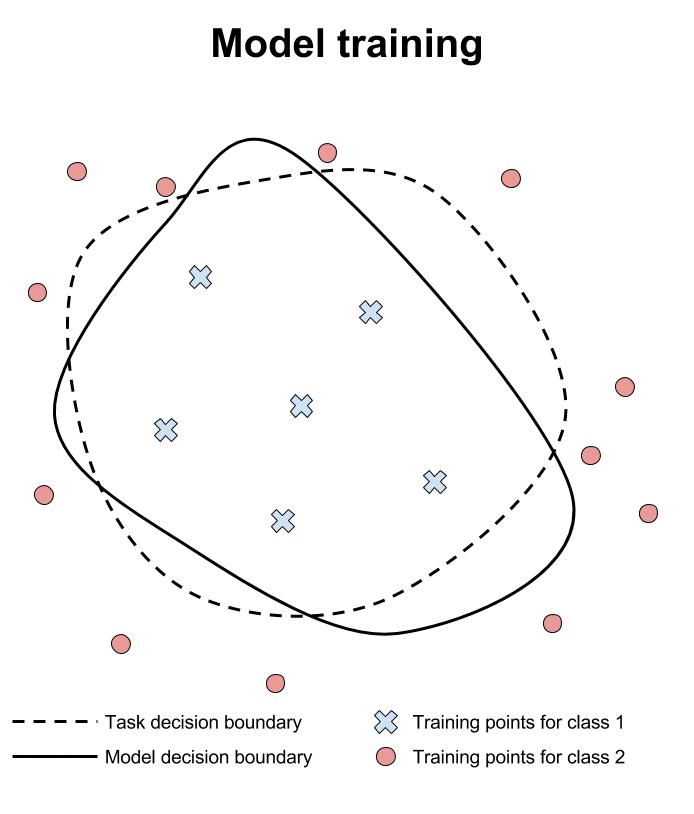

# The challenge of verification and testing of machine learning

Jun 14, 2017

by Ian Goodfellow and Nicolas Papernot

在我们的第二篇博文中，我们给了一些背景来解释为什么攻击机器学习通常要比防御来得简单。我们看到了一些为什么我们仍然不能完全有效的防御对抗样本的理由，我们也在想，这样的一种防御是否真的存在。

在这篇博文中，我们探索了**几种方式来保证一个机器模型的可控性**。我们认为现有的的防御存在局限性，其缺乏对机器学习模型的验证。在实际中，为了设计可靠的系统，工程师通常会进行测试和验证都做：
- 通过测试，我们想在多种条件下评测这个系统并观察它的表现，看看是否有缺陷
- 通过验证，我们想得到一个可信的论点，即系统在极大的范围内都不会出错。

与这个问题垂直相关的另一问题是，我们应当对哪些输入值进行验证和测试。我们是仅试图针对「自然产生」的合法输入做验证和测试，还是在任意特定恶意的输入上，都能对模型的行为做保证呢？许多软件系统比如编译器，都对一些输入会有未定义的行为。

## 我们应该做测试还是验证？在怎样的输入下？

机器学习的从业者传统上主要依靠测试。一个分类器的评价方式通常是，从测试集中采样出几个样本，在上面做测试并测量它的准确性。从定义上将，这种测试流程不能发现所有可能且未见到的，会被误分类的样本。

衡量测试集误差的验证模拟依靠于统计学习理论 [V98]。统计学习理论为测试错误率提供了一个上界的保证，确保它不会超过某个阈值，但是这些保证通常过于保守，导致对工程师的实践来说没啥用。

并且就算用了统计学习理论，模型也通常只考虑「自然产生」的输入：即其是和训练数据从同一个分布中采样出来的。

## 把攻击者引入「方程式」中来

为了提供安全性保障，我们有必要从这两方面做改进：1）我们必须使用验证而非测试，同时 2）我们必须确保模型在攻击者制作的异常输入下也能安全运转。一个经典的研究员想要保证的特性，就是模型能够在面对对抗样本的时候更加鲁棒一些。

有一种很自然的测试模型对对抗样本的鲁棒性的方式是，拿一个加了对抗扰动的测试集来制作对抗样本，测试模型在此上面的准确率 [SZS13]。这是机器学习中一种传统的测试方法，只是换了一组新的输入。

不幸的是，光是做测试并不足以提供安全性保障，因为一个攻击者可以发送一个不存在于测试流程中的输入。比如，经过测试发现，一个模型能对 fast gradient sign method (快速梯度符号法) [GSS14] 产生的对抗样本鲁棒，但它可能对其他计算量更大的方法，如 numerical optimization (数值优化法) [SZS13] 或 saliency maps (梯度显著性图) [PMJ16] 来说显得很脆弱。

通常来说，测试不足以保障安全是因为它只对系统的错误率提供一个下界，而为了提供安全性保证，我们需要一个上界。换句话说，做完测试发现了 n 个输入能造成系统故障，那么工程师就可以说至少有 n 个输入能使系统故障。但是工程师更想要的是，能够合理的确认最多有 n 个输入会造成系统故障。

在以上针对机器学习讨论到的关于测试的局限性，让人想起许多在软件设计中出现的观点。在讨论到保证程序正确性的方法的时候，Edsger Dijkstra 说过：测试证明的是 bugs 存在，而不是证明它们不存在。

显然，对传统的机器学习应用来说，在一些「自然产生」的输入上做测试就足够了，但是为了保证安全，必须对异常的输入做验证。我们应该做验证，但是目前为止我们只知道怎么做测试。

如及的机器学习模型很容易攻破，光是在异常的输入上做测试就足够暴露出它们的缺陷了。希望在不久的将来我们能够有更好的防御对抗样本的手段。测试有可能不再能够暴露出这种模型的缺陷，那么我们将需要验证这项技术来保证新的防御方式的有效性。对正确处理的输入空间的安全保证，是未来对抗环境下的机器学习发展的一个重要方向，而它又几乎肯定会以形式验证为基础。

## 机器学习的理论验证

验证机器学习模型对对抗样本的鲁棒性仍处于起步阶段。当前的方法验证到一个分类器会给一个点 x 所有领域的点都分到同一个类上。在下面的动画中，我们会展示这类方法并将其与测试同一邻域的各个点作比较。

研究人员正在努力地构建对神经网络的验证系统。不幸的是，这些系统还不成熟。 Pulina 等人开发出了第一个验证系统，用于证明圣经网络的输出类别在一个限定的邻域内是恒定的 [PT10]。但第一个系统只适用于一个隐藏层，且其隐藏层的单元不到数十个。此外，它的 sigmoid 函数也是通过约束来近似的，从而将问题规约到 SAT 上。

后来，Huang 等人改进了这个初始的方法，并提出了一种新的验证系统，其适用于现代的神经网络架构 [HKW16]。这个系统扩展到了如 ImageNet 分类器这种更大的网络。但仍有保留下来的限制，新的验证系统依赖于各种假设，比如，神经网络中只有一部分隐层单元与每个输出有关。这个假设意味着系统不能够提供一个对对抗样本的绝对保证，因为对抗样本可能不遵循这种假设（比如，它能使用不相关的隐层单元），从而能够逃开检测。

Reluplex [KBD17] 是另一个用 LP solvers 来扩展到更大的网络的验证系统。通过专注于整流线性网络 [GBB11，JKL09，NH10] 及其分段线性结构，Reluplex 能够变得更加高效。

这些当前的验证系统应用的范围有限，因为他们只验证，输出类别保持在常值的一个特定点 x 周围的一些特定的邻域。这其中存在两个限制：
1. 我们没有办法来穷举所有的，附近能有恒定的输出的 x 这样的点（我们不能想象到所有未来的「自然产生」的输入）。
2. 对 x 周围的邻域，我们如今限定得有点武断：我们倾向于使用 Lp 范式下一个小的球形空间，因为这符合人类的观察直觉：对于一个足够小的标准的球，所有球内的点应该属于同一个类别。但实际上具有同一类别的点应该分布在一个更大的，更不规则的形状的空间中。

总而言之，验证机器学习模型首先需要我们定义合法的输入区间，比如是我们希望模型正确分类的输入的集合。这组合法的输入通常远大于大多数标准的数据集中所包含的测试集。再者，研究人员必须设计验证技术能有效地保证在整个合法的输入下，机器学习预测的正确性。机器学习常遇到的挑战是，其可能需要泛化到新的输入上，这会让前者变成一个尤其难实现的目标，正如本文 [PT10, HKW16, KBD17] 上所努力试图说明的一样。在这种情况下，其他社区开发的技术，通过一些像测试一样的流程，可以对机器学习模型进行部分验证，其中一个很好的例子就是，模糊测试给计算机安全领域带来的正面作用。

## 对抗设定下是否也存在「没有免费的午餐」定理？

值得一提的是，可能不存在完美的验证系统，因为没有机器学习模型能够完全鲁棒并准确。在实际中，来自那些新的，泛化到之前所未见却又合法的输入 x 的附近的输入，挑战是最难克服的

在传统的机器学习的设定下，一个机器学习系统在新的测试样本上的表现会有清晰的理论限制。例如，「没有免费的午餐」定理 [W96] 指出，当所有的数据集是等可能出现的时候，所有的有监督分类算法在面对新的测试样本的时候准确率都是一样的。

一个重要的开放性的理论问题就是「没有免费的午餐」定理是不是能扩展到对抗设定下。如果我们假定攻击者通过加了一些小扰动来操控了测试集，那么「没有免费的午餐」定理的前提：平均值取自所有可能的数据集（其中包括分类器不应忽略的带扰动的数据集），就不再适用了。

根据这个问题得到的解决方案，在攻击者和防御者进行军备竞赛的时候会出现两种不同的结果。因为在预测新的测试样本的正确值的时候具有固有的统计上的困难性，攻击者可能从根本上就占有优势地位。但如果我们足够幸运的话，防御者可能会在一个广泛的问题类上具有基础性的优势，而这为设计和验证鲁棒的算法铺平了道路。

对这个问题有兴趣的读者可以在 [PMS16] 中找到对这个问题的一些初步讨论。这里面的分析刻画了模型的准确性和对对抗样本的鲁棒性之间的权衡。其中表明，存在有攻击者能找到一个分布来增加学习者的 loss 的时候，也就说明了学习者也就能迁移到一个更丰富的假设类并从中收益。其中更丰富的假设类被非正式地定义成更复杂的假设类，其能对任何分布都提供一个更小的 loss。因此，在数据有限的情况下可能会有些麻烦，因为要学习更复杂的假设在实践中通常需要更多的数据。

## 来自 CleverHans 的测试复现

从理论的角度上说，验证具有挑战性，但从实际的角度看的话，做测试也是很有挑战性的事。假如一个研究者提出了一个新的防御手段，并且通过一个特定的攻击样本攻击流程来评价它。如果这个模型能够取得高精度，是不是就代表它是有效的呢？也许是，但也有可能是研究人员实现的攻击太弱了。当研究人员在一些他们实现的通用的防御手段上，实现他们自己提出的攻击手段的时候，也存在这样的问题（把防御流程实现得太弱了）。

为了解决这些困难，我们创建了 CleverHans 这个库。这个库中实现了几个攻击和防御流程。研究人员和开发人员可以用 CleverHans 来对他们的模型进行标准的，行业领先的攻击和测试。通过这种方式，如果一个防御手段能在 CleverHans 的攻击下取得高精度，那么说明它是强大的。同样，如果一个攻击能是的 CleverHans 有很高的失败率，那么可以说这个攻击是强大的。此外，这让已经发表的成果能够互相比较，只要他们是用同一版本的 CleverHans 及相似的计算环境下做出的实验。

## 结论

机器学习模型的验证仍属于起步阶段，因为现有的方法所做的假设使得它无法对对抗样本作出绝对的安全保证。我们希望我们的读者能够有所想法，并解决其中的一些问题。另外，我们鼓励研究人员用 CleverHans 来提高对抗设定下的机器学习模型测试的可重复性。

## 致谢

谢谢 Martin Abadi 在阅读这篇博文的草稿后给的反馈。谢谢 Marta Kwiatkowska 在指出比较测试和验证的动图说明中的一个颜色错误。

## 参考文献

- [GBB11] Glorot, X., Bordes, A., & Bengio, Y. (2011, April). Deep Sparse Rectifier Neural Networks. In Aistats (Vol. 15, No. 106, p. 275).
- [GSS14] Goodfellow, I. J., Shlens, J., & Szegedy, C. (2014). Explaining and harnessing adversarial examples. arXiv preprint arXiv:1412.6572.
- [HKW16] Huang, X., Kwiatkowska, M., Wang, S., & Wu, M. (2016). Safety Verification of Deep Neural Networks. arXiv preprint arXiv:1610.06940.
- [JKL09] Jarrett, K., Kavukcuoglu, K., & LeCun, Y. (2009, September). What is the best multi-stage architecture for object recognition?. In Computer Vision, 2009 IEEE 12th International Conference on (pp. 2146-2153). IEEE.
- [KBD17] Katz, G., Barrett, C., Dill, D., Julian, K., & Kochenderfer, M. (2017). Reluplex: An Efficient SMT Solver for Verifying Deep Neural Networks. arXiv preprint arXiv:1702.01135.
- [NH10] Nair, V., & Hinton, G. E. (2010). Rectified linear units improve restricted boltzmann machines. In Proceedings of the 27th international conference on machine learning (ICML-10) (pp. 807-814).
- [PMJ16] Papernot, N., McDaniel, P., Jha, S., Fredrikson, M., Celik, Z. B., & Swami, A. (2016, March). The limitations of deep learning in adversarial settings. In 2016 IEEE European Symposium on Security and Privacy (EuroS&P) (pp. 372-387). IEEE.
- [PMS16] Papernot, N., McDaniel, P., Sinha, A., & Wellman, M. (2016). Towards the Science of Security and Privacy in Machine Learning. arXiv preprint arXiv:1611.03814.
- [PT10] Pulina, L., & Tacchella, A. (2010, July). An abstraction-refinement approach to verification of artificial neural networks. In International Conference on Computer Aided Verification (pp. 243-257). Springer Berlin Heidelberg.
- [SZS13] Szegedy, C., Zaremba, W., Sutskever, I., Bruna, J., Erhan, D., Goodfellow, I., & Fergus, R. (2013). Intriguing properties of neural networks. arXiv preprint arXiv:1312.6199.
- [V98] Vapnik, V. (1998). Statistical Learning Theory.
- [W96] Wolpert, D. H. (1996). The lac